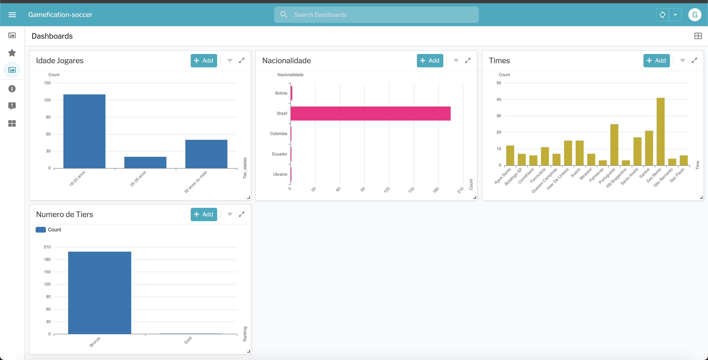
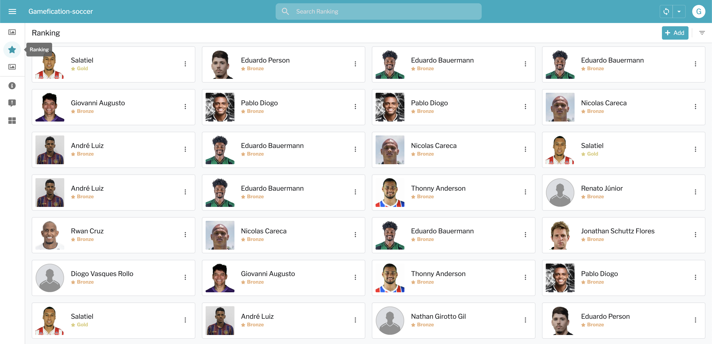

### Gamefication-soccer

## Sobre
Projeto de Rankeamento do Campeonato Paulista 2023 utilizando os dados do API Football utilizando App Sheet, NodeJs para carregamento de dados e Google Sheet como banco de dados e excel de extração

## Versões utilizadas 💘

Versão do NodeJs -v18.17.1

Versão do NPM - 9.6.7

## Desafio

Criação de uma plataforma de Gameficação, Os jogadores de futebol representarão nosso público alvo e participarão de um programa gamificado. Nesta gamificação, cada jogador recebe pontos com base em alguns critérios

## Desafios do projeto

1. API Football limitadas a 10 requests por minuto além de limite de 1000 requests por dia, o que para um sistema de automação muitas vezes pode ser falho
2. Curva de aprendizado rapido do AppSheet principalmente de implmentação de Scripts
3. Pegar dados massivos dos jogares de Futebol

## Features do projeto
[X] Visão de ranking dos jogadores por pontuação, um recurso que destaque os top 10 jogadores.
[X] Gráficos organizando os jogadores por países e por faixa etária (18-24 anos, 25-29 anos, 30 anos ou mais).
[X] Extração de dados de 200 jogadores de futebo
[X] Construção da aplicação de gerenciamento do programa.

## Coisas que gostaria de ter implementado
[X] CronJob ou Automation Bot no AppSheet para rodar o script e assim ele ser atualizado todos os dias os codigos
[X] Testes de segurança de vulnerabilidade tanto no Appsheet e tanto no projeto
 
## Passo a passo de como utilizar e rodar o projeto 💡

1. Para podermos utilizar precisaremos criar o arquivo .env dentro do nosso projeto, todos os dados estão em vault e para isso é necessario receber um acesso meu.
2. Crie um arquivo chamado .env e dele pegue as informações necessarias de credenciais do google e do api-football
3. Rode `npm run dev` para fazer as instalações necessarias das libs
4. Rode `node index.js` e logo estará fazendo o processamento para envio de dados a planilha 

## Imagens da aplicação

## Tecnologias usadas nesse projeto projeto 💻

- 🍃 [AppSheet](https://about.appsheet.com/home/)
- 💎 [Planilha Google](https://docs.google.com/spreadsheets)
- 🐳 [NodeJs](https://nodejs.org/en)

